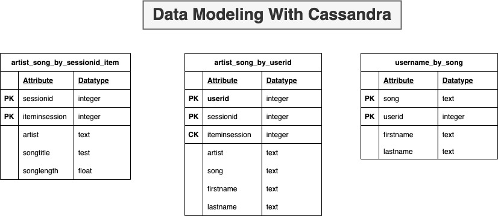

# Project: Data Modeling With Postgres

### Sparkify wants to analyse the user and songs data collected on their music streaming app. The analysis team needs to understand what songs users are listening. The model needs to be developed based on the following queries which needs to be answered

##### 1. Give me the artist, song title and song's length in the music app history that was heard during  sessionId = 338, and itemInSession  = 4
##### 2. Give me only the following: name of artist, song (sorted by itemInSession) and user (first and last name) for userid = 10, sessionid = 182
##### 3. Give me every user name (first and last) in my music app history who listened to the song 'All Hands Against His Own'

## Data Source 
The collected data is stored on the csv file.

### csv file structure

### Data Model

### Project Files

The project and the source data files are are the repository

- <b>data</b> : All the data files are stored in the <b>event_data</b> folder. The files are in csv format

- <b>Data_Modelling_Cassandra.ipynb</b> : This jupyter notebook was created based on the code provided in the project template. All the data import from the source, creation of tables and the execution of queries is implmented in the notebook. The files below are created as part of ETL pipeline based on the coding in the jupyter notebook.

- <b>sql_queries.py</b> : This is a script file contaiing all the SQL commands to DROP and CREATE the tables

- <b>create_tables.py</b> : This script file connects to the cassandra database and executes the sql queries in <b>sql_queries.py</b> to drop, recreate the tables.

- <b>etl.py </b> : The script file connects to the source directory and merges all the source csv files into one csv file which is then used to insert the data into the respective tables in the cassandra database

- <b>check_etl_results.ipynb</b> This jupyter notebook is used to test the data loaded into the respective tables. It also drops all the tables. 

# Execution 
## Option 1
Open run the following jupyter notebook, which will import the data into tthe tables and check the results
- Data_Modelling_Cassandra.ipynb 

## Option 2 
ETL Pipeline execution and Testing
Open the console and exetute the following code
- create_tables.py
- etl.py
- Open and run the jupyter notebook check_etl_results.ipynb to test the results